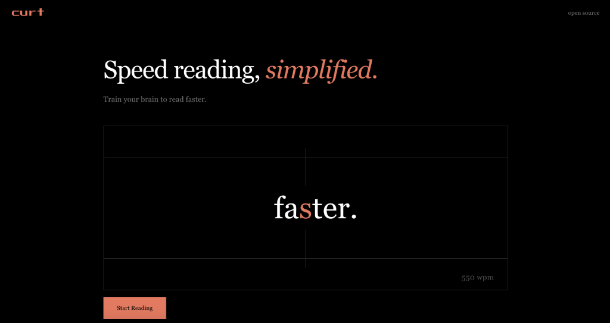

<div align="center">

# curt




### can u read this?

A minimalist RSVP (Rapid Serial Visual Presentation) reader designed to improve reading speed and retention.

</div>

## Overview

Reading on the web is often cluttered and slow. curt strips away distractions, delivering text one word at a time at a speed you control. Whether you want to breeze through articles or train yourself to read faster, curt provides the environment to focus.

## Features

- **RSVP Reading**: High-contrast, single-word display with a red focal point.
- **Variable Modes**:
  - **Linear**: Smooth acceleration to build rhythm.
  - **Block**: Stepped speed increases for progressive training.
  - **Constant**: Fixed pace for consistency.
- **Daily Challenge**: A curated daily text to benchmark your WPM.
- **Archive**: Track your reading history locally.

## Stack

- Next.js 15 (App Router)
- TypeScript
- Tailwind CSS
- Framer Motion
- Neon (PostgreSQL)

## Local Development

Clone the repository.

```bash
git clone https://github.com/GithubAnant/curt.git
cd wpm-maker
```

Install dependencies.

```bash
npm install
```

Set up environment variables.

```bash
cp .env.example .env.local
```

Run the development server.

```bash
npm run dev
```

Open [http://localhost:3000](http://localhost:3000) to view it in the browser.

## License

MIT
